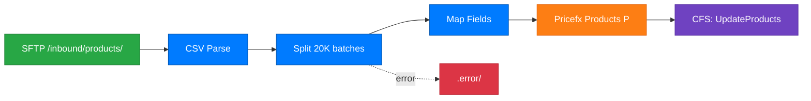

# Document Route

Generate comprehensive documentation for one or more Pricefx Integration Manager routes. Produces both a plain-language summary (for non-technical stakeholders) and a Mermaid data flow diagram (for visual reference) in a single markdown file.

## Step 1: Determine Mode

Check `$ARGUMENTS`:

- **Route name or file path** — single-route mode for that route.
- **"all"** — diagram all routes and generate a project-level overview as well.
- **"--project"** — delegate to the `document-project` agent for full project documentation. Stop here.
- **No arguments** — ask: **What would you like to document?**
  - A single route (name or pick from list)
  - The whole project (`--project`)

If listing routes:

```bash
ls src/main/resources/repo/routes/
```

## Step 2: Read the Route and Supporting Files

For each route to document:

1. **Route XML** — `src/main/resources/repo/routes/{route-name}.xml`
2. **Mapper(s)** — look for `{route-name}.mapper.xml` or any mapper referenced in the route:
   ```bash
   grep -o 'mapper=[^&"]*' src/main/resources/repo/routes/{route-name}.xml
   ```
   Then read: `src/main/resources/repo/mappers/{mapper-name}.xml`
3. **Filter(s)** — look for any filter referenced in the route:
   ```bash
   grep -o 'filter=[^&"]*' src/main/resources/repo/routes/{route-name}.xml
   ```
   Then read: `src/main/resources/repo/filters/{filter-name}.xml`
4. **Properties** — read `src/main/resources/repo/config/application.properties` for context on schedule, paths, and connections.
5. **Direct references** — find all `direct:` references:
   ```bash
   grep -o 'direct:[^"&]*' src/main/resources/repo/routes/{route-name}.xml
   ```
   For each `direct:{name}` found, read `src/main/resources/repo/routes/{name}.xml` to follow chained routes.

## Step 3: Analyze the Route

Extract the following from the files read:

| Aspect | What to look for |
|--------|-----------------|
| **Source** | `<from uri="...">` — file, SFTP, timer, event, REST, Kafka |
| **Trigger** | timer cron expression, file arrival, event name, manual |
| **Data format** | CSV, JSON, XML, database rows |
| **Transformations** | mapper field mappings, filters, Groovy expressions, splits |
| **Target** | `pfx-api:loaddata`, `pfx-api:loaddataFile`, `pfx-rest`, `pfx-sql` — what Pricefx object or external system |
| **Batch size** | `batchSize=` parameter |
| **On success** | archive/move/delete patterns, post-import calculations (`onCompletion`) |
| **On error** | `moveFailed`, `onException`, error folder pattern |
| **Schedule** | cron expression decoded to human language |
| **Chained routes** | `<to uri="direct:...">` references |

### Cron expression decoder

| Pattern | Meaning |
|---------|---------|
| `0 0 * * * ?` | Every hour |
| `0 0 2 * * ?` | Daily at 2:00 AM |
| `0 0 6 ? * MON` | Every Monday at 6:00 AM |
| `0 30 8 1 * ?` | 1st of every month at 8:30 AM |
| File `<from>` with no timer | On-demand (file trigger) |
| `repeatCount=1` timer | Runs once on startup |

### Source type decoder

| URI prefix | Business meaning |
|-----------|-----------------|
| `file://` | Local/SFTP folder (files dropped into a monitored folder) |
| `pfx-sftp:` | External SFTP server |
| `timer:` | Scheduled (runs on a cron or fixed interval) |
| `pfx-event:` | Triggered by a Pricefx event (e.g., after a calculation) |
| `pfx-rest:` | Calls an external REST API |
| `pfx-sql:` | Queries a database |
| `kafka:` | Kafka topic |
| `aws-s3:` or `pfx-s3:` | S3 bucket |

### Target object decoder

| objectType | Business name |
|-----------|---------------|
| `P` | Pricefx Product Master |
| `PX` | Pricefx Product Extension |
| `C` | Pricefx Customer Master |
| `CX` | Pricefx Customer Extension |
| `SL` | Pricefx Seller |
| `SX` | Pricefx Seller Extension |
| `DS` / `DMDS` | Pricefx PA Data Source |
| `PPV` / `LTV` / `MLTV2` | Pricefx Pricing Parameters |

### Source node labels (for diagram)

| URI prefix | Node label |
|-----------|-----------|
| `file://` or `pfx-sftp:` with local path | `SFTP /path/` |
| `pfx-sftp:` with external host | `SFTP {host}` |
| `timer:` | `Timer ({schedule})` |
| `pfx-event:` | `Event: {eventName}` |
| `pfx-rest:get` | `REST GET {endpoint}` |
| `pfx-sql:` | `SQL Query` |
| `kafka:` | `Kafka {topic}` |
| `aws-s3:` or `pfx-s3:` | `S3 {bucket}` |

### Target node labels (for diagram)

| URI pattern | Node label |
|------------|-----------|
| `pfx-api:loaddata?objectType=P` | `Pricefx Products (P)` |
| `pfx-api:loaddata?objectType=PX` | `Pricefx Product Ext (PX)` |
| `pfx-api:loaddata?objectType=C` | `Pricefx Customers (C)` |
| `pfx-api:loaddata?objectType=CX` | `Pricefx Customer Ext (CX)` |
| `pfx-api:loaddata?objectType=DS` or `DMDS` | `Pricefx Data Source` |
| `pfx-api:loaddata?objectType=PPV` | `Pricefx Params (PPV)` |
| `pfx-api:cfs` | `CFS: {name}` |
| `pfx-api:flush` | `Flush` |
| `pfx-rest:post` | `REST POST {endpoint}` |
| `pfx-sftp:` (outbound) | `SFTP Export` |
| `pfx-s3:` (outbound) | `S3 Write` |

## Step 4: Generate Plain-Language Summary

Output the following structure as the first section of the markdown file:

```
## Summary

**What:** {One sentence describing the business purpose — what data moves where}
**When:** {Trigger description in plain language — file arrival, daily at X, on event, etc.}
**Source:** {What data comes in — file type, columns if known, system name}
**Target:** {Pricefx object type and table name, or external system}
**Processing:** {Key transformations in plain language — filtering, splitting, field mapping highlights}
**On Success:** {What happens after successful import — archive, calculation trigger, notification}
**On Error:** {What happens on failure — error folder, retry, alert}
**Schedule:** {Human-readable schedule or "on demand"}
```

### Example summary

```
## Summary

**What:** Imports product master data from CSV files into the Pricefx Product catalog.
**When:** Triggered when a new CSV file appears in the /inbound/products/ monitored folder.
**Source:** CSV file with columns: SKU, Name, Category, List Price, Status
**Target:** Pricefx Products (P) — maps to fields: sku, label, attribute1 (Category), attribute2 (Price), attribute3 (Status)
**Processing:** File is split into batches of 20,000 records for efficient loading. Prices converted from string to decimal. Inactive products (Status=N) filtered out before import.
**On Success:** File moved to .archive/2026/03/ folder. CFS calculation "UpdateProductAttributes" triggered.
**On Error:** File moved to .error/ folder. Error logged with file name and timestamp.
**Schedule:** On demand (file trigger — no cron schedule).
```

## Step 5: Generate Mermaid Data Flow Diagram

Build a Mermaid diagram as the second section of the same markdown file.

### Node ID rules
- Use short camelCase IDs (no spaces, no special chars): `SftpIn`, `CsvParse`, `Split`, `LoadP`, `CfsTrigger`, `ErrFolder`
- Make IDs unique across the diagram

### Style rules
- Use `flowchart LR` for a single route (left to right)
- Use `flowchart TB` for project overview (top to bottom)
- Use solid arrows `-->` for normal data flow
- Use dashed arrows `-.->` with `|error|` label for error paths
- Use dashed arrows `-.->` with `|on complete|` label for post-completion paths
- Apply color classes:

```
classDef source fill:#28a745,color:#fff,stroke:#1e7e34
classDef process fill:#007bff,color:#fff,stroke:#0056b3
classDef target fill:#fd7e14,color:#fff,stroke:#e36209
classDef error fill:#dc3545,color:#fff,stroke:#bd2130
classDef cfs fill:#6f42c1,color:#fff,stroke:#5a32a3
```

Assign classes: sources -> `:::source`, processing steps -> `:::process`, targets -> `:::target`, error nodes -> `:::error`, CFS/flush -> `:::cfs`.

### Subgraphs for chained routes

Wrap each chained route in a subgraph:

```
subgraph main ["import-products"]
  ...
end
subgraph split ["split-and-load"]
  ...
end
main --> split
```

### Example single-route diagram



## Step 6: Save Markdown File

Save the combined output to `docs/routes/{route-name}.md`:

```markdown
# {Route Name} — Documentation

Generated from `src/main/resources/repo/routes/{route-name}.xml`.

## Summary

{PLAIN_LANGUAGE_SUMMARY}

## Data Flow

```mermaid
{MERMAID_SYNTAX}
```
```

Keep the file concise — summary + diagram only, no raw XML or technical internals.

## Step 7: Project Overview (all-routes mode only)

When documenting all routes, also generate `docs/routes/project-overview.md` using `flowchart TB`.

Group routes by their source type in subgraphs:
- `subgraph imports ["Import Routes"]`
- `subgraph exports ["Export Routes"]`
- `subgraph events ["Event-Driven Routes"]`
- `subgraph scheduled ["Scheduled Routes"]`

Connect routes that are linked via `direct:` references with labeled arrows.

## Important Rules

- Keep diagrams under 200 lines of Mermaid syntax — split complex routes into subgraphs rather than expanding every step
- Never include customer data, partition names, passwords, or API keys in diagram labels
- If a label contains a property placeholder like `{{pfx:route.sftp.path}}`, simplify it to a generic label (e.g., `SFTP /inbound/`) for readability
- Only generate `.md` output (Mermaid renders natively in IDE markdown preview)
- Report the paths of files created after completion
