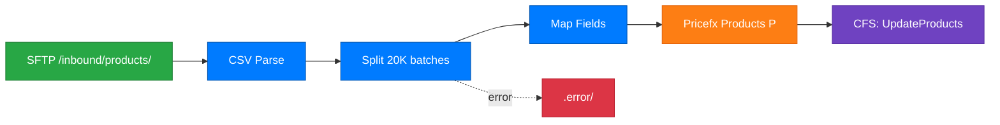

# Generate Flow Diagram

Generate a Mermaid flowchart diagram from one or more Pricefx Integration Manager route XML files. Produces Markdown files with Mermaid code blocks, renderable natively in VS Code, IntelliJ, and GitLab/GitHub.

## Step 1: Identify Route(s) to Diagram

If `$ARGUMENTS` contains a route name or file path, use it directly.
Otherwise ask: **Which route do you want to diagram?** Then list available routes:

```bash
ls src/main/resources/repo/routes/
```

If the user says "all routes" or "project overview", diagram all routes and generate a project-level overview as well.

## Step 2: Read Route XML and Follow Direct References

For each route to diagram:

1. Read the route XML: `src/main/resources/repo/routes/{route-name}.xml`
2. Find all `direct:` references in the route:
   ```bash
   grep -o 'direct:[^"&]*' src/main/resources/repo/routes/{route-name}.xml
   ```
3. For each `direct:{name}` found, read `src/main/resources/repo/routes/{name}.xml` to follow chained routes.
4. Read referenced mappers and filters to understand transformations:
   ```bash
   grep -o 'mapper=[^&"]*' src/main/resources/repo/routes/{route-name}.xml
   grep -o 'filter=[^&"]*' src/main/resources/repo/routes/{route-name}.xml
   ```

## Step 3: Analyze Route Structure

Extract the following from the route XML:

| Element | What to look for |
|---------|-----------------|
| **Source** | `<from uri="...">` — file, pfx-sftp, timer, pfx-event, pfx-rest, kafka |
| **Processing steps** | `pfx-csv:`, `pfx-json:`, `<split>`, `pfx-mapper:`, Groovy transforms |
| **Target** | `pfx-api:loaddata`, `pfx-api:loaddataFile`, `pfx-rest:post`, `pfx-sftp:`, `pfx-s3:` |
| **Error handling** | `<onException>`, `moveFailed=`, error folder in URI |
| **Post-completion** | `<onCompletion>`, `pfx-api:cfs`, notification steps |
| **Chained routes** | `<to uri="direct:...">` references |

### Source node labels

| URI prefix | Node label |
|-----------|-----------|
| `file://` or `pfx-sftp:` with local path | `SFTP /path/` |
| `pfx-sftp:` with external host | `SFTP {host}` |
| `timer:` | `Timer ({schedule})` |
| `pfx-event:` | `Event: {eventName}` |
| `pfx-rest:get` | `REST GET {endpoint}` |
| `pfx-sql:` | `SQL Query` |
| `kafka:` | `Kafka {topic}` |
| `aws-s3:` or `pfx-s3:` | `S3 {bucket}` |

### Target node labels

| URI pattern | Node label |
|------------|-----------|
| `pfx-api:loaddata?objectType=P` | `Pricefx Products (P)` |
| `pfx-api:loaddata?objectType=PX` | `Pricefx Product Ext (PX)` |
| `pfx-api:loaddata?objectType=C` | `Pricefx Customers (C)` |
| `pfx-api:loaddata?objectType=CX` | `Pricefx Customer Ext (CX)` |
| `pfx-api:loaddata?objectType=DS` or `DMDS` | `Pricefx Data Source` |
| `pfx-api:loaddata?objectType=PPV` | `Pricefx Params (PPV)` |
| `pfx-api:cfs` | `CFS: {name}` |
| `pfx-api:flush` | `Flush` |
| `pfx-rest:post` | `REST POST {endpoint}` |
| `pfx-sftp:` (outbound) | `SFTP Export` |
| `pfx-s3:` (outbound) | `S3 Write` |

## Step 4: Generate Mermaid Flowchart Syntax

Build a Mermaid diagram using the node labels from Step 3.

### Node ID rules
- Use short camelCase IDs (no spaces, no special chars): `SftpIn`, `CsvParse`, `Split`, `LoadP`, `CfsTrigger`, `ErrFolder`
- Make IDs unique across the diagram

### Style rules
- Use `flowchart LR` for a single route (left to right)
- Use `flowchart TB` for project overview (top to bottom)
- Use solid arrows `-->` for normal data flow
- Use dashed arrows `-.->` with `|error|` label for error paths
- Use dashed arrows `-.->` with `|on complete|` label for post-completion paths
- Apply color classes:

```
classDef source fill:#28a745,color:#fff,stroke:#1e7e34
classDef process fill:#007bff,color:#fff,stroke:#0056b3
classDef target fill:#fd7e14,color:#fff,stroke:#e36209
classDef error fill:#dc3545,color:#fff,stroke:#bd2130
classDef cfs fill:#6f42c1,color:#fff,stroke:#5a32a3
```

Assign classes: sources → `:::source`, processing steps → `:::process`, targets → `:::target`, error nodes → `:::error`, CFS/flush → `:::cfs`.

### Subgraphs for chained routes

Wrap each chained route in a subgraph:

```
subgraph main ["import-products"]
  ...
end
subgraph split ["split-and-load"]
  ...
end
main --> split
```

### Example single-route diagram



## Step 5: Save Markdown File

Create the output directory if needed:

```bash
mkdir -p docs/diagrams
```

Save to `docs/diagrams/{route-name}-flow.md`:

```markdown
# {Route Name} — Data Flow

Generated from `src/main/resources/repo/routes/{route-name}.xml`.

```mermaid
{MERMAID_SYNTAX}
```
```

## Step 6: Project Overview (all-routes mode only)

When diagramming the entire project, also generate `docs/diagrams/project-overview-flow.md` using `flowchart TB`.

Group routes by their source type in subgraphs:
- `subgraph imports ["Import Routes"]`
- `subgraph exports ["Export Routes"]`
- `subgraph events ["Event-Driven Routes"]`
- `subgraph scheduled ["Scheduled Routes"]`

Connect routes that are linked via `direct:` references with labeled arrows.

## Important Rules

- Keep diagrams under 200 lines of Mermaid syntax — split complex routes into subgraphs rather than expanding every step
- Never include customer data, partition names, passwords, or API keys in diagram labels
- If a label contains a property placeholder like `{{pfx:route.sftp.path}}`, simplify it to a generic label (e.g., `SFTP /inbound/`) for readability
- Only generate `.md` output (Mermaid renders natively in IDE markdown preview)
- Report the paths of both files created after completion
